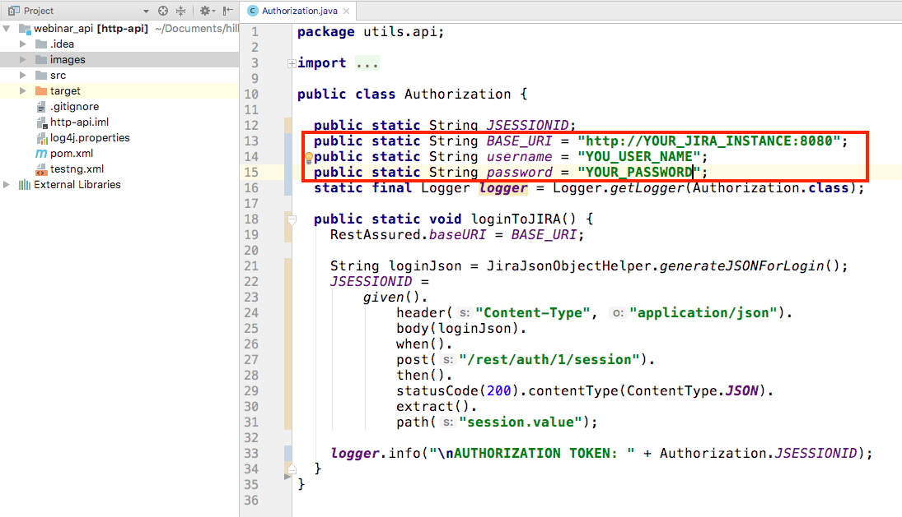
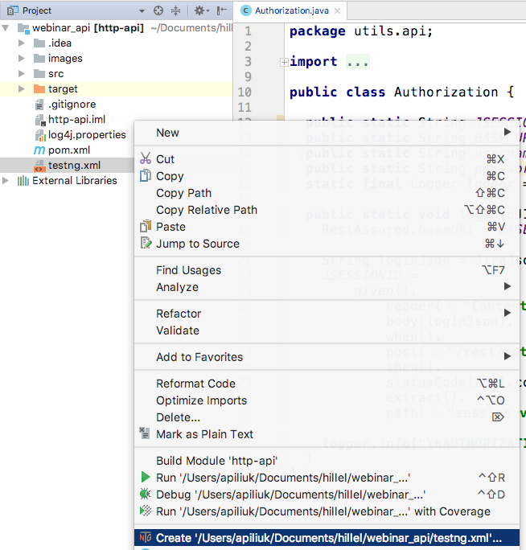

# Useful links
JIRA API - https://developer.atlassian.com/cloud/jira/platform/rest/#api-api-2-issue-post

# About framework
This frameowrk was created for manual QA who are familiar with Java and would like to automate Web API(HTTP).
There are for layers in this example, which show how to implement "Abstraction Layers" to make the code more readable and 
reusable. It is up to you to choose at which layer to stop according to the time resources.

# How to run tests
Tests can be launched from Intellij Idea. 
1. download source code, 
2. import code as a Maven project (https://www.youtube.com/watch?v=bud6BXb_53c)
3. update Authorization.java file with your jira instance and credentials

4. add TestNG run configuration as shown on screenshot and run it

# List of used libriaries, frameworks and details about what was used
TestNG
RestAssured

